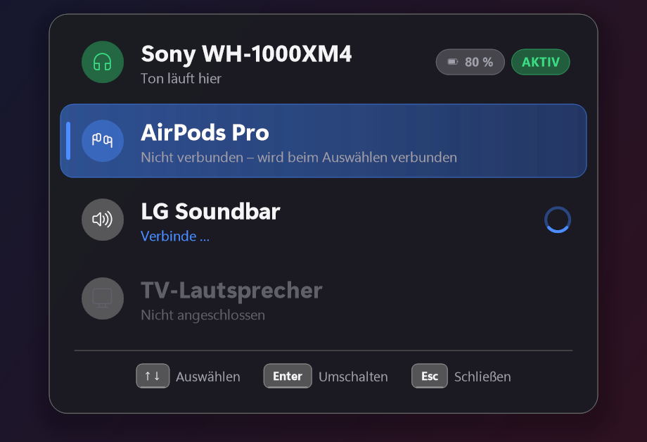

# BT-Switcher

**Switch your PC's audio output from the couch — one hotkey, no mouse, no Windows settings.**

Built for a living-room HTPC running a fullscreen media app (Stremio, Kodi, Plex, …) controlled with a small wireless keyboard. Press the hotkey, pick your headphones or soundbar with the arrow keys, done — Bluetooth devices get connected automatically and your movie keeps running in fullscreen.

<p align="center"></p>

## Features

- **One hotkey** (`Ctrl+Alt+B` by default) opens a TV-readable overlay on top of any fullscreen app
- **Connects Bluetooth devices** on demand and sets them as the Windows default output
- **Wired outputs too** — HDMI (TV speakers), USB, analog
- **Instant** — overlay appears in < 35 ms, focus goes straight back to your media app
- Battery level, auto-disconnect of the previous BT device, pauses playback while connecting
- Lives in the system tray, starts with Windows, tiny (< 1 MB single `.exe`)

## Usage

| Key | Action |
|---|---|
| `↑` `↓` / `1`–`9` | Select device |
| `Enter` | Switch |
| `Esc` / hotkey | Close |

Devices, hotkey and look are configured via **tray icon → Einstellungen** (or `%APPDATA%\BTSwitcher\config.json`).

> The UI is currently in German.

## Install

Requires Windows 10/11 x64 and the [.NET 10 Desktop Runtime](https://dotnet.microsoft.com/download/dotnet/10.0).

```powershell
git clone https://github.com/itzhouze/BluetoothSwitcher.git
cd BluetoothSwitcher
dotnet publish BluetoothSwitcher -c Release
```

Run `BTSwitcher.exe` from `BluetoothSwitcher\bin\Release\net10.0-windows\win-x64\publish\` and enable *Mit Windows starten* in the tray menu.

## How it works

Bluetooth audio is (re)connected via the kernel-streaming property `KSPROPSETID_BtAudio` — the same mechanism as *Connect* in the Windows sound panel. The default device is set through `IPolicyConfig`. The overlay is a per-pixel-alpha layered window, so the app behind it stays visible. C# / .NET 10 WinForms, Win32 interop via [CsWin32](https://github.com/microsoft/CsWin32), no other dependencies.
